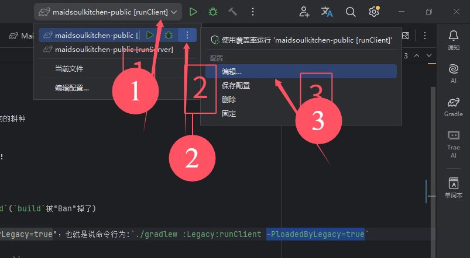
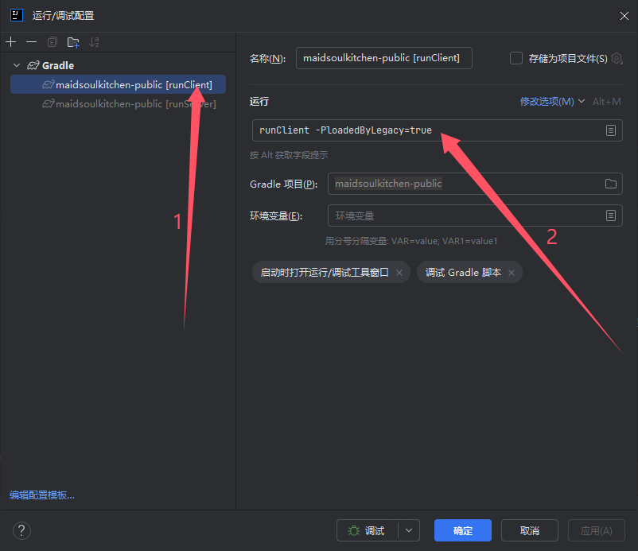
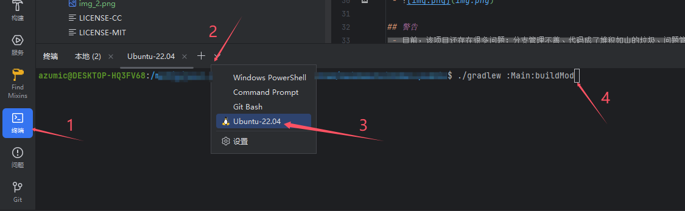

<h1 align="center">
 农耕与烹饪：车万女仆拓展
 |
 <a href="./readme.en.md">
      Maidsoul Kitchen
 </a>
</h1>

这里是一个[车万女仆](https://github.com/TartaricAcid/TouhouLittleMaid)附属模组，旨在让女仆学会使用其他模组的烹饪和作物的耕种

## 注意
- 目前项目处于半弃坑状态，如若打算将本模组作为主要模组之一，还请慎重考虑！
- 当然，建议还是可以提的，只是要做好最坏的打算，不然可能会被我绊上一大脚

## 开发提示
- 项目打包需要使用`Main`模块下的`gradle`任务:`Task/build/buildMod`(`build`被"Ban"掉了)
- 命令行打包的方式为在根目录下执行命令:`./gradlew :Main:buildMod`
- Legacy模块下的`runClient`任务需要在末尾添加额外参数："-PloadedByLegacy=true"，也就是说命令行为:`./gradlew :Legacy:runClient -PloadedByLegacy=true`
- 或者你可以这样编辑配置：
- 添加新的任务需要在相关类的上方添加`@TaskClassAnalyzer(TaskInfo.xxx)`
- 添加新的mixin(如果是给任务服务的、mixin其他模组的)，同样也需要在相关类的上方添加注解`@TaskMixin(TaskInfo.xxx)`
- 这样在项目打包的时候就会自动生成对应的数据，可以达到拦截生产环境下的因为其他模组的更新而炸了的效果
- 目前还不接受主动兼容我的mod，目前项目还处于不稳定状态，项目结构很有可能会发生大变化...（欢迎和我交流你的想法）

## 项目打包
- 目前项目依赖过多，在`windows`环境下打包项目会触发`短路径问题`，可能需要再`linux`环境下打包
- 目前楼主使用的是`wsl+idea/github action`的方案打包
- `wsl+idea`: 楼主参照[Win10 系统安装 Linux 子系统教程(WSL2 + Ubuntu 20.04 + xlaunch桌面 ）](https://www.cnblogs.com/Ada-CN/p/18627211)、[WSL](https://intellijidea.com.cn/help/idea/how-to-use-wsl-development-environment-in-product.html)，这两篇文章配置的wsl环境，（应该是这样，实际上看了很多，忘记了都参照了那些了...）
- 后面便是正常使用`idea`打开项目，依次点击输入命令等待即可
- 

## 警告
- 目前，该项目还存在很多问题：分支管理不善、代码成了堆积如山的垃圾、问题管理等等......
- 还请理解，项目会在半年后重构一正常情况下([`2.0-dev`](https://github.com/Wall-ev/MaidsoulKitchen/tree/1.20.1-2.0-dev))...

## 注意
- 由于作者个人原因，开发进度会及其缓慢（保不准会弃坑...）
- 如果您想尽快游玩，可以在[Releases](https://github.com/Wall-ev/TouhouLittleMaidAddon/releases)页面找到自动构建好的最新版，
- 如果您下载了自动构建的版本，那么在游玩前需要做好备份措施，以免损失财产。
- 这个项目随时会弃坑，如果你想（你能接受这个烂摊子——水平极烂的话...），你可以接手这个项目。

## 致谢
[`TartaricAcid`](https://github.com/TartaricAcid): 包括但不限于技术上的支持

[`Pajinyi`](https://space.bilibili.com/9322946): 美术支持

[`lezizijiang2`](https://github.com/lezizijiang2): 1.21.1的迁移
